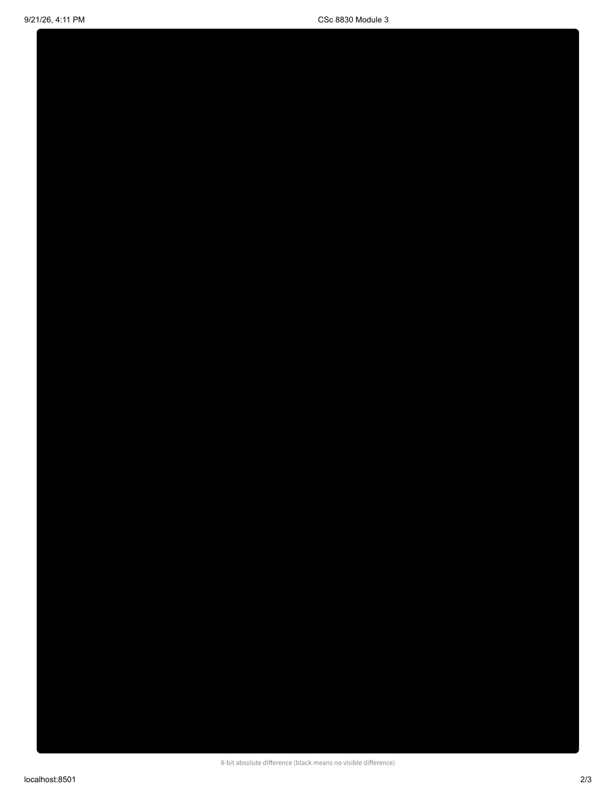
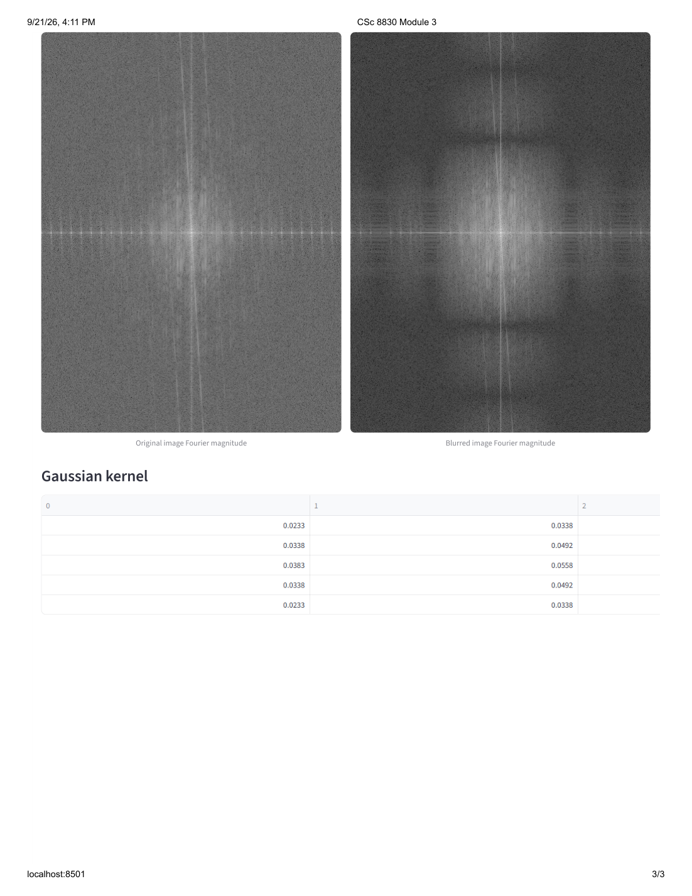

# CSc 8830 Computer Vision - Module 3
## Image Blurring Using Spatial and Fourier-Domain Filtering

**Student:** Olumide Adebisi
**GitHub:** https://github.com/Olumide1996/CSC8830_Module3

### 1. Objective

The goal of this module is to implement image blurring with a spatial filter and then show experimentally that the same result can be obtained in the Fourier domain. The key idea is that convolution in the spatial domain corresponds to multiplication in the frequency domain.

### 2. Implementation

A normalized Gaussian kernel is used as the blur filter. The spatial result is obtained with centered zero-padded convolution. For the Fourier implementation, the image and kernel are padded to the full linear-convolution size, their 2-D FFTs are multiplied point-by-point, and the inverse FFT produces the filtered image.

The web application displays the original image, the spatially filtered image, the Fourier-domain result, the absolute difference, and numerical error statistics.

### 3. Theory: Why the Two Methods Are Equivalent

Let `f[m,n]` be an input image and `h[m,n]` be a blur filter. The spatial convolution is

`g[m,n] = sum_r sum_s f[r,s] h[m-r,n-s]`.

The 2-D discrete Fourier transform (DFT) of `f[m,n]` is

`F[p,q] = sum_m sum_n f[m,n] exp(-j 2*pi*(pm/M + qn/N))`.

Similarly, the Fourier transform of the filter is

`H[p,q] = sum_m sum_n h[m,n] exp(-j 2*pi*(pm/M + qn/N))`.

Now take the DFT of the convolution:

`G[p,q] = sum_m sum_n g[m,n] exp(-j 2*pi*(pm/M + qn/N))`.

Substituting the convolution equation gives

`G[p,q] = sum_m sum_n sum_r sum_s f[r,s] h[m-r,n-s] exp(-j 2*pi*(pm/M + qn/N))`.

Let

`a = m-r` and `b = n-s`.

Then `m = a+r` and `n = b+s`, so the exponential term can be separated:

`exp(-j 2*pi*(p(a+r)/M + q(b+s)/N))`

`= exp(-j 2*pi*(pa/M + qb/N)) exp(-j 2*pi*(pr/M + qs/N))`.

This separates the expression into one term containing the filter and one term containing the image. Therefore,

`G[p,q] = F[p,q] H[p,q]`.

Taking the inverse DFT gives

`g[m,n] = IDFT{F[p,q] H[p,q]}`.

Therefore, convolution in the spatial domain is equivalent to multiplication in the Fourier domain.

#### Connection to the implementation

A DFT normally produces circular convolution because of its periodic boundary assumption. To make the Fourier-domain calculation match the ordinary linear convolution used for the image, the implementation zero-pads the image and filter to the full convolution size:

`(H + Kh - 1) x (W + Kw - 1)`.

The two FFTs are then multiplied point-by-point and the inverse FFT is taken. The result is cropped back to the original image size. With this padding, the circular convolution of the padded arrays is equivalent to the desired linear convolution.

This is why the spatial and Fourier-domain implementations in this project should produce the same image, apart from very small floating-point rounding errors.

### 4. Experimental Validation

The experiment was run using the included sample image. The same Gaussian blur was applied in two ways: directly using spatial convolution and indirectly by multiplying the Fourier transforms of the image and filter. Several kernel settings were tested.

| Kernel | Sigma | MAE | RMSE | Maximum absolute error |
|---:|---:|---:|---:|---:|
| 5 x 5 | 1.2 | 3.081e-14 | 4.023e-14 | 2.558e-13 |
| 9 x 9 | 2.0 | 3.468e-14 | 4.510e-14 | 3.126e-13 |
| 15 x 15 | 3.0 | 3.902e-14 | 5.045e-14 | 2.558e-13 |

For all three experiments, the results were marked as equivalent within a tolerance of `1e-10`. The very small errors are consistent with floating-point rounding during numerical calculations.

### 5. Observed Result

The spatially filtered image and the Fourier-domain filtered image were visually indistinguishable in the experiments. The web application also confirmed that the resulting 8-bit images were identical, with a maximum pixel difference of zero.

For the 9 x 9 kernel with sigma 2.0, the mean absolute error was approximately `3.47e-14`, the RMSE was approximately `4.51e-14`, and the maximum absolute error was approximately `3.13e-13`.

These differences are extremely small and are consistent with normal floating-point numerical precision. The results therefore provide experimental evidence that convolution in the spatial domain produces the same result as multiplication in the Fourier domain when the linear-convolution boundary conditions are handled correctly.

### 6. Web Application

A Streamlit web application was created to demonstrate the image-blurring experiment in a browser. The user can upload an image, select the Gaussian kernel size and sigma value, and compare the output from spatial convolution with the output from Fourier-domain multiplication.

The main results page shows the original image, the spatially filtered image, the Fourier-domain result, and the numerical validation metrics.

For the 5 x 5 Gaussian kernel with sigma = 2.0, the application reported a mean absolute error of approximately `3.15e-14`, an RMSE of approximately `4.12e-14`, and a maximum absolute error of approximately `2.27e-13`. The application also reported that the 8-bit output images were identical, with a maximum pixel difference of zero.

The absolute-difference image is shown below. The image is completely black, indicating that there is no visible difference between the two 8-bit results.

The application also displays the Fourier magnitude of the original and blurred images and the Gaussian filter used in the experiment.

### 7. Software Validation

The implementation was also checked with three automated tests using Pytest. All three tests passed successfully. These tests verify the spatial convolution, Fourier-domain implementation, and numerical agreement between the two approaches.

### 8. Conclusion

The implementation demonstrates that a blur filter can be applied either directly in the spatial domain or by multiplying Fourier transforms in the frequency domain. After correct zero-padding and cropping, the two approaches produce the same result to numerical precision. The experiment therefore provides practical evidence of the convolution theorem.
